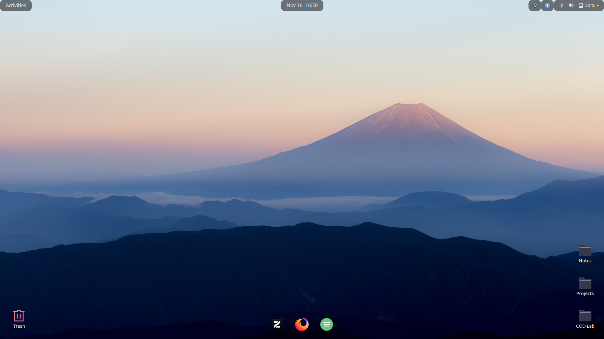
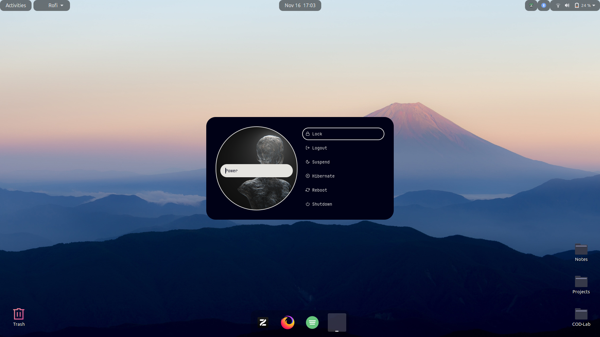
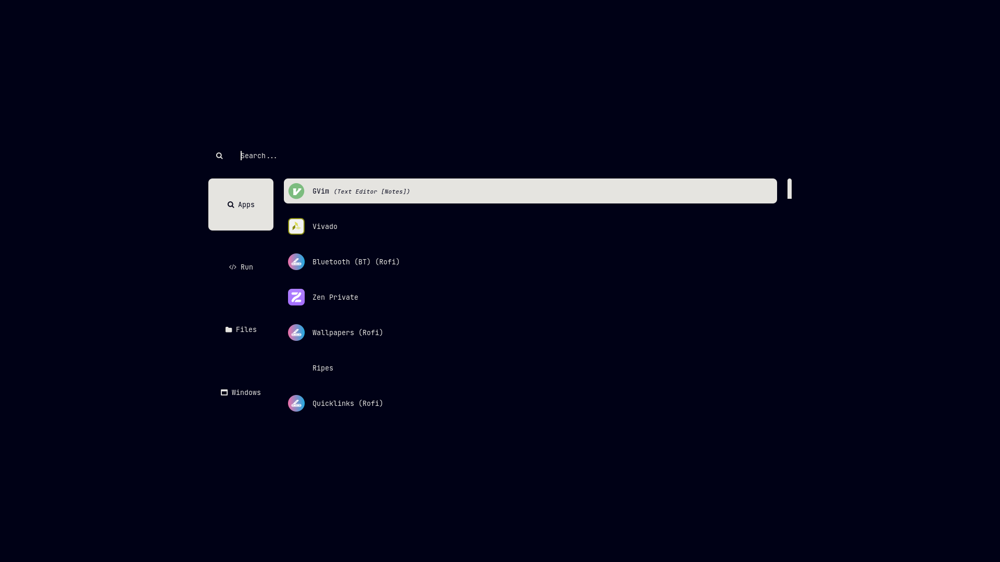
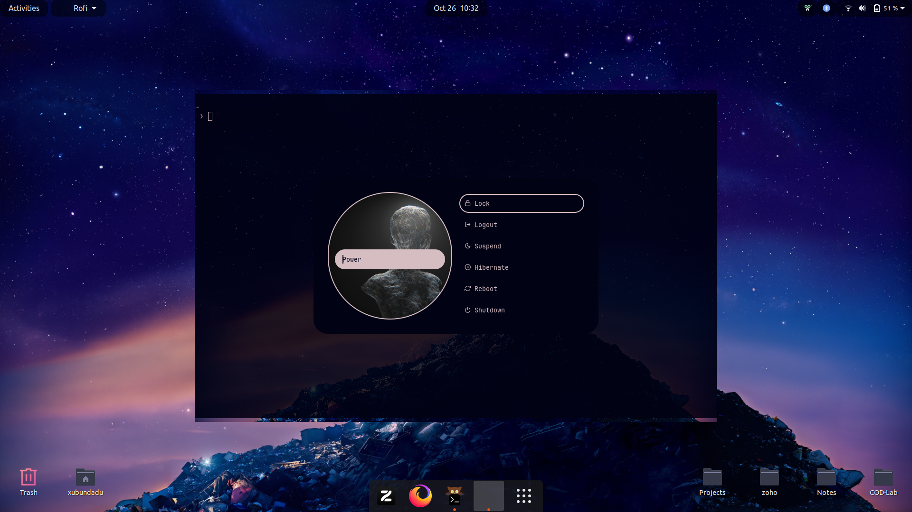

# My dotfiles

## Screenshots






## System
- Ubuntu 20.04 LTS
- GNOME Shell 3.36.9

## How to use
```sh
cd
git clone https://github.com/Daedalus-op/dotfiles ~/.dotfiles # clone the repo
sudo apt install stow # Installing stow
cd dotfiles
stow $folder_name
```
## Configurations
- Rofi - Launcher
- Kitty - Aesthetic terminal
- Starship - Cleaner terminal
- Startpages - Browser startpages
- Vim - Plugins and keybinds
- wal - Dynamic Themeing with wallpapers
- gtk-theme - Tokyonight

## Extenstions
- Floating Dock
- User themes

> [!Note]
> All Wallpapers and LOGOs are stored in the custom folder
