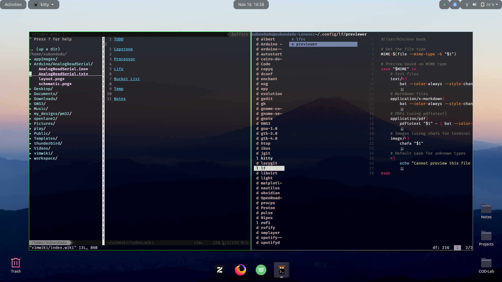

# My dotfiles

## Screenshots




## System
- Ubuntu 20.04 LTS
- GNOME Shell 3.36.9

## How to use
```sh
cd
git clone https://github.com/Daedalus-op/dotfiles $HOME/.dotfiles # clone the repo
sudo apt install stow # Installing stow
cd dotfiles
stow $folder_name
```
## Configurations
- Rofi - Launcher
- Kitty - Aesthetic terminal
- Starship - Cleaner terminal
- Startpages - Browser startpages
- Vim - Plugins and keybinds
- wal - Dynamic Themeing with wallpapers
- gtk-theme - Tokyonight
- lf - Terminal file explorer

## Extenstions
- Floating Dock
- User themes

> [!Note]
> - All Wallpapers and LOGOs are stored in the custom folder
> - Use `:PlugInstall` to install all vim plugins, otherwise comment the plugins out
> - Launch rofi applet using `applet` command (Use `applet -h` for more info)
> - In case of error from rofi comment out line 22 of `$HOME/.dotfiles/rofi/.config/rofi/launchers/type-1/shared`

## References
- [adi1090x Rofi Collection](https://github.com/adi1090x/rofi)
