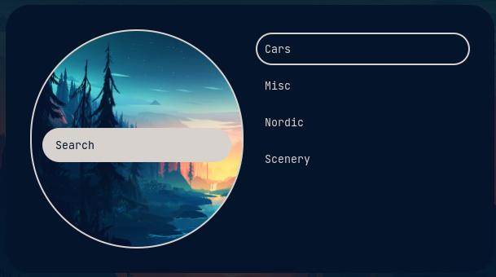
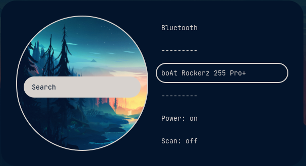
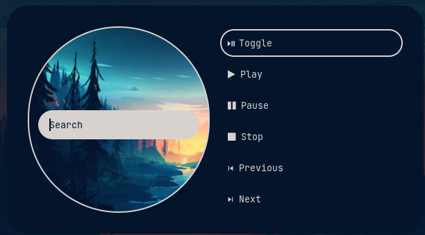
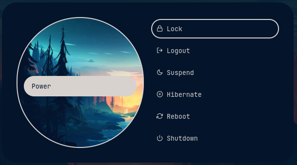

# Rofi

## Applets
- Wallpapers/ Theme changer (pywal) 

- Bluetooth Manager (bluetoothctl) 

- Now Playing control (playerctl) 

- Powermenu (systemctl) 
 

- Web Search 
 

- Wifi Manager (nmcli)
- Quicklinks
